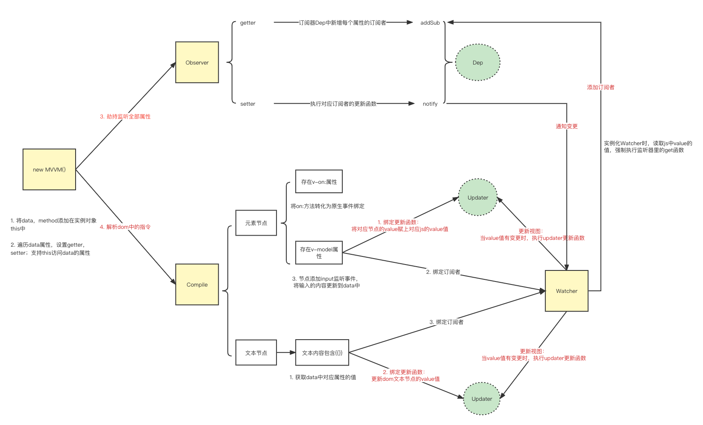
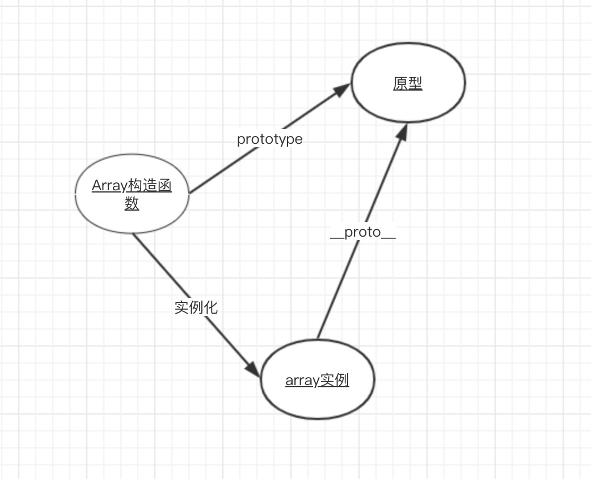
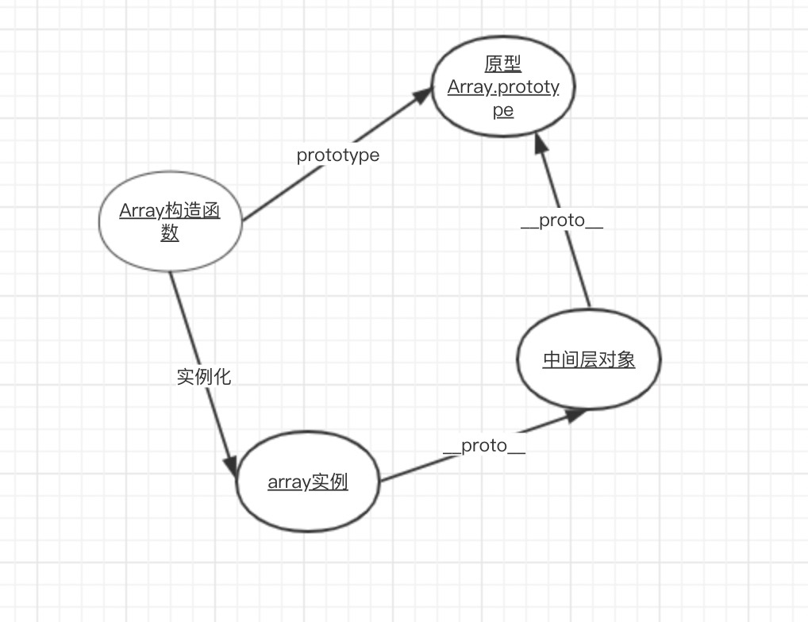

## VUE

### 1. Vue的响应式（双向绑定）原理

> 参考：https://github.com/febobo/web-interview/issues/2

双向绑定由三个重要部分构成：

1. 监听器 Observer：利用 `Object.defineProperty()` 通过递归的方式对所有属性都添加 setter、getter 方法进行监听；用来劫持并监听所有属性，如果发生变动，则通知订阅者。
2. 订阅器 Dep：用来收集订阅者，对监听器 `Observer` 和 订阅者 `Watcher` 进行统一管理；
3. 订阅者 Watcher：可以收到属性的变化通知并执行相应的方法，从而更新视图；
4. 解析器 Compile：可以解析每个节点的相关指令，对模板数据和订阅器进行初始化。

当数据改变时，会触发`setter`，并且通过`Dep.notify`去通知所有`订阅者Watcher`，订阅者们就会调用`patch方法`，给真实DOM打补丁，更新相应的视图。




### 4. 为什么在 Vue3.0 采用了 Proxy，抛弃了 Object.defineProperty？

#### Object.defineProperty的缺点

- 不能监听数组；因为数组没有getter和setter。

- 无法监控到数组下标的变化
- 不能监听数组动态length的变化

- 只能监听属性，而不是整个对象；需要遍历属性；

#### Proxy的优点

1. Proxy的监听是针对一个对象的，对这个对象的所有操作会进入监听操作
2. Proxy可以直接监听数组的变化

### 5.vue怎么解决数组响应式的，vue 是如何对数组方法进行变异的？例如 push、pop、splice 等方法

Vue 不能检测以下数组的变动：

- 当你利用索引直接设置一个数组项时，例如：vm.items[indexOfItem] = newValue
- 当你修改数组的长度时，例如：vm.items.length = newLength或者使用Vue.set()|vm.$set()强行将数据添加到响应式里

为了能够监听数组，Vue2重写了部分数组方法去实现视图更新：

`array.__proto__ === Array.prototype` 为`true`



为了拦截到数组的变异方法，可以在实例和原型之间在插入一层：



我们让数组实例array的`__proto__`属性指向中间层对象， 中间层对象的`__proto__`属性指向`Array.prototype`，

当我们通过实例去访问数组的变异方法时，根据原型链的查找规则，会先在中间层对象中查找，

 这样，我们就实现了对数组变异方法的拦截

### 6. 怎么解决data未定义的值不会响应

1. Vue里的数据不能够动态添加根级响应式 property。也就是说必须在初始化实例前声明所有根级响应式 property
2. 使用Vue.set()|vm.$set()强行将数据添加到响应式里

### △7. 发布-订阅者模式

### △8. Vue中虚拟DOM的理解

> 参考：https://github.com/febobo/web-interview/issues/23

#### 是什么

Virtual DOM 其实就是一棵以 JavaScript 对象( VNode 节点)作为基础的树，用对象属性来描述节点，实际上它只是一层对真实 DOM 的抽象。最终可以通过一系列操作使这棵树映射到真实dom环境上

创建虚拟`DOM`就是为了更好将虚拟的节点渲染到页面视图中，所以虚拟`DOM`对象的节点与真实`DOM`的属性一一照应

#### 写出对应的虚拟DOM

```js
<ul id='list'>
  <li class='item'>Item 1</li>
  <li class='item'>Item 2</li>
  <li class='item'>Item 3</li>
</ul>

var element = {
  tag: 'ul', // 节点标签名
  props: { // DOM的属性，用一个对象存储键值对
    id: 'list'
  },
  children: [ // 该节点的子节点
    {tag: 'li', props: {className: 'item'}, children: ["Item 1"]},
    {tag: 'li', props: {className: 'item'}, children: ["Item 2"]},
    {tag: 'li', props: {className: 'item'}, children: ["Item 3"]},
  ]
}
```

#### 为什么使用

渲染真实DOM会有一定的开销，如果每次修改数据都进行真实DOM渲染，都会引起DOM树的重绘和重排，性能开销很大。

虚拟DOM中，在DOM的状态发生变化时，虚拟DOM会进行Diff运算，来更新只需要被替换的DOM，而不是全部重绘

#### 虚拟DOM的Diff算法

> 参考：https://github.com/febobo/web-interview/issues/24

**Diff算法是一种对比算法**。对比两者是`旧虚拟DOM和新虚拟DOM`，对比出是哪个`虚拟节点`更改了，找出这个`虚拟节点`，并只更新这个虚拟节点所对应的`真实节点`，而不用更新其他数据没发生改变的节点，实现`精准`地更新真实DOM，进而`提高效率`。

所以Diff算法是:`深度优先算法`。 时间复杂度:`O(n)`

**Diff算法特点**：

1. 只会在同层级进行, 不会跨层级比较
2. 标签名不同，直接删除，不继续深度比较
3. 标签名相同，key相同，就认为是相同节点，不继续深度比较


- 当数据发生改变时，订阅者`watcher`就会调用`patch`给真实的`DOM`打补丁

- 通过`isSameVnode`进行判断（标签名相同，key相同），相同则调用`patchVnode`方法，不相同则新建一个dom节点替换到真是dom上

- `patchVnode`做了以下操作：

  - 找到对应的真实`dom`，称为`el`

  - 如果新vnode有text，且旧vnode的text与新vnode不相等：

    1. 如果旧vnode有子节点而新vnode没有，则删除`el`子节点
    2. 设置`el`文本节点设置为`Vnode`的文本节点

  - 如果新vnode无text，有子节点时：

    1. 如果新vnode和旧vnode都有子节点，则执行`updateChildren`函数比较子节点
    2. 如果旧vnode是文本节点，清除`el`中的text内容，在`el`的子节点添加新vode的子节点
    3. 如果新vnode无子节点，旧vnode有子节点，则删除`el`子节点
    4. 如果新vnode无

  - 如果`oldVnode`没有子节点而`VNode`有，则将`VNode`的子节点真实化后添加到`el`

    

- `updateChildren`主要做了以下操作：

  - 设置新旧`VNode`的头尾指针
  - 新旧头尾指针进行比较，循环向中间靠拢，根据情况调用`patchVnode`进行`patch`重复流程、调用`createElem`创建一个新节点，从哈希表寻找 `key`一致的`VNode` 节点再分情况操作

### 9. 打印结果是什么

```js
<template>  
  <div>    
  <div ref="test">{{test}}</div>    
	<button @click="handleClick">tet</button>  
	</div>
</template>
export default {
    data () {
        return {
            test: 'begin'
        };
    },
    methods () {
        handleClick () {
            this.test = 'end';
            console.log(this.$refs.test.innerText); // 打印结果：“begin”
        }
    }
}
```

#### 为什么 

Vue 在更新 DOM 时是异步执行的，只要观察到数据变化，Vue 将开启一个队列，并缓冲在同一事件循环中发生的所有数据改变。

如果同一个 watcher 被多次触发，只会被推入到队列中一次，这种在缓冲时去除重复数据对于避免不必要的计算和 DOM 操作上非常重要

#### 如何修改可以获取最新的值

使用nextTick

#### 讲一下nextTick的原理

JS执行是单线程的，它是基于事件循环的。事件循环大致分为以下几个部分：

1. 所有同步任务在主线程上执行，形成一个执行栈。
2. 主线程之外，还存在一个“任务队列”。只要异步有了运行结果。就在"任务队列"中放置一个事件。
3. 一旦"执行栈"中所有的同步任务执行完毕，系统就会读取“任务队列”，看看里面有哪些事件。那些对应的异步任务，于是结束等待状态，进入执行栈，开始执行。
4. 主线程不断重复上面的第三步。


nextTick中维护了一个callbacks队列，一个pending锁，一个timerFunc。

1. 每次调用$nextTick的过程其实就是在向任务队列新增回调函数等待执行；

2. 任务队列新增回调函数后又执行了timerFunc函数，将回调函数放入微任务或者宏任务，等待下一次事件循环时来执行
3. 第一次添加回调函数到任务队列中，执行timerFunc，并加锁。
4. timerFunc函数的作用：对当前环境进行不断的降级处理，尝试使用原生的`Promise.then`、`MutationObserver`和`setImmediate`，上述三个都不支持最后使用setTimeout；

### 10. 为什么要异步更新视图

mounted的时候test的值会被++循环执行1000次。

每次++时，都会根据响应式触发setter->Dep->Watcher->update->patch。 

如果这时候没有异步更新视图，那么每次++都会直接操作DOM更新视图，这是非常消耗性能的。 

所以Vue.js实现了一个queue队列，在下一个tick的时候会统一执行queue中Watcher的run。

同时，拥有相同id的Watcher不会被重复加入到该queue中去，所以不会执行1000次Watcher的run。

最终更新视图只会直接将test对应的DOM的0变成1000。

```js
<template>
  <div>
    <div>{{test}}</div>
  </div>
</template>
export default {
    data () {
        return {
            test: 0
        };
    },
    mounted () {
      for(let i = 0; i < 1000; i++) {
        this.test++;
      }
    }
}
```

```js
export default {
  data () {
    return {
      msg: 0
    }
  },
  mounted () {
    this.msg = 1
    this.msg = 2
    this.msg = 3
  },
  watch: {
    msg () {
      console.log(this.msg) // 只会输出一次：3
    }
  }
}
```

### 11. Vue中key的作用

> 参考：https://github.com/Advanced-Frontend/Daily-Interview-Question/issues/1

#### 不用 key：

- **就地复用节点**。在比较新旧两个节点是否是同一个节点的过程中会判断成新旧两个节点是同一个节点，因为 a.key 和 b.key 都是 undefined。所以不会重新创建节点和删除节点，只会在节点的属性层面上进行比较和更新。所以可能在某种程度上（创建和删除节点方面）会有渲染性能上的提升；
- **无法维持组件的状态**。由于就地复用节点的关系，可能在维持组件状态方面会导致不可预知的错误，比如无法维持改组件的动画效果、开关等状态；
- **也有可能会带来性能下降**。因为是直接就地复用节点，如果修改的组件，需要复用的很多节点，顺序又和原来的完全不同的话，那么创建和删除的节点数量就会比带 key 的时候增加很多，性能就会有所下降；

#### 用 key：

- **维持组件的状态，保证组件的复用**。因为有 key 唯一标识了组件，不会在每次比较新旧两个节点是否是同一个节点的时候直接判断为同一个节点，而是会继续在接下来的节点中找到 key 相同的节点去比较，能找到相同的 key 的话就复用节点，不能找到的话就增加或者删除节点。
- **查找性能上的提升**。有 key 的时候，会生成 hash，这样在查找的时候就是 hash 查找了，基本上就是 O(1) 的复杂度。
- **节点复用带来的性能提升**。因为有 key 唯一标识了组件，所以会尽可能多的对组件进行复用（尽管组件顺序不同），那么创建和删除节点数量就会变少，这方面的消耗就会下降，带来性能的提升。

#### 总结：性能提升不能只考虑一方面，不是 diff 快了性能就快，不是增删节点少了性能就快，不考虑量级的去评价性能，都只是泛泛而谈。

```js
<div id="app">
    <div v-for="i in dataList">{{ i }}</div>
</div>
var vm = new Vue({
  el: '#app',
  data: {
    dataList: [1, 2, 3, 4, 5]
  }
})
// 以上的例子，v-for的内容会生成以下的dom节点数组，我们给每一个节点标记一个身份id：
[
    '<div>1</div>', // id： A
    '<div>2</div>', // id:  B
    '<div>3</div>', // id:  C
    '<div>4</div>', // id:  D
    '<div>5</div>'  // id:  E
 ]
```

- 没有key的情况下可以对节点就地复用，提高性能。

- 改变dataList数据，进行数据位置替换，`vm.dataList = [4, 1, 3, 5, 2] // 数据位置替换`

  - 有key

    ```js
    // 有key的情况，dom节点位置进行了交换，但是内容没有更新
      // <div v-for="i in dataList" :key='i'>{{ i }}</div>
      [
        '<div>4</div>', // id： D
        '<div>1</div>', // id:  A
        '<div>3</div>', // id:  C
        '<div>5</div>', // id:  E
        '<div>2</div>'  // id:  B
      ]
    ```

  - 没有key

    ```js
    // 没有key的情况， 节点位置不变，但是节点innerText内容更新了
      [
        '<div>4</div>', // id： A
        '<div>1</div>', // id:  B
        '<div>3</div>', // id:  C
        '<div>5</div>', // id:  D
        '<div>2</div>'  // id:  E
      ]
    ```

- 增删dataList列表项，`vm.dataList = [3, 4, 5, 6, 7] // 数据进行增删`

  - 有key

    ```js
    // 2. 有key的情况， 节点删除了 A, B 节点，新增了 F, G 节点
      // <div v-for="i in dataList" :key='i'>{{ i }}</div>
      [
        '<div>3</div>', // id： C
        '<div>4</div>', // id:  D
        '<div>5</div>', // id:  E
        '<div>6</div>', // id:  F
        '<div>7</div>'  // id:  G
      ]
    ```

  - 没有key

    ```js
    // 1. 没有key的情况， 节点位置不变，内容也更新了
      [
        '<div>3</div>', // id： A
        '<div>4</div>', // id:  B
        '<div>5</div>', // id:  C
        '<div>6</div>', // id:  D
        '<div>7</div>'  // id:  E
      ]
    ```

### 12. Vue生命周期

> beforeUpdate -> updated过程会重新渲染一份最新的dom树，重新渲染到真实的页面上

- **beforeCreated：**
  - 状态：el、data、methods未被初始化，data/methods/computed以及watch上的数据都不能被访问，
  - 使用场景：常用于初始化非响应变量。还可以增加一些loading的动画效果然后在`created()`的时候移除。
- **created**：
  - 状态：vue实例创建完成，完成了data、methods的初始化，可以使用和更该数据，但是更改数据不会触发updated。当前阶段无法与DOM交互，如果非要交互用$nextTick。
  - 使用场景：如果要调用methods中的方法，最早只能在created中操作；进行ajax请求异步数据的获取、初始化数据
- **beforeMount**：
  - 状态：模板已经在内存中编译好了，但是尚未挂载在页面中，此时页面还是旧的
- **mounted**： 
  - 状态：真实的DOM已经挂载完毕，数据也完成双向绑定，
  - 使用场景：可以访问DOM节点，可以使用$ref属性对DOM进行操作。
- **beforeUpdate**： 
  - 状态：页面显示的数据还是旧数据，data值已更新，可以监听到data的变化但是view层没有被重新渲染
- **updated**： 
  - 状态：页面和data数据已经保持同步了
  - 使用场景：任何数据的更新，做统一的业务逻辑处理
- **beforeDestroy**：
  -  状态：钩子函数在实例销毁之前调用。在这一步，实例仍然完全可用。
  - 使用场景：可做一些交互提示，比如：你确认xx吗？。也可以用于销毁定时器、移除事件监听器、解绑全局时间、销毁插件对象等，避免内存泄露。
- **destroyed**：
  - 状态： 钩子函数在Vue 实例销毁后调用。调用后，Vue 实例指示的所有东西都会解绑定，所有的事件监听器会被移除，所有的子实例也会被销毁。
- **activated**：
  - 状态：`keep-alive`组件激活时调用。
  - 使用场景：有的时候对某些页面做了缓存，从别的页面返回到此页面时，需要手动触发一些接口数据来更新页面，此时就可以在此生命周期内进行。
- **deactivated**：
  - 状态：`keep-alive`组件停用时调用。

### 13. Vue 的父组件和子组件生命周期钩子执行顺序是什么

- 加载渲染过程：
  父 beforeCreate -> 父 created -> 父 beforeMount -> 子 beforeCreate -> 子 created -> 子 beforeMount -> 子 mounted -> 父 mounted
- 父子组件更新过程
  父 beforeUpdate -> 子 beforeUpdate -> 子 updated -> 父 updated
- 销毁过程
  父 beforeDestroy -> 子 beforeDestroy -> 子 destroyed -> 父 destroyed

### 14. computed和watch分别实现什么功能 --> 区别是什么

#### 功能

watch - 侦听器 是被动的，他是监听到数据变化后才会触发watch，然后去更新数据，
watch比较适用与当一个对象变化来改变父组件或者子组件内多个对象或者条件的变化时

computed是主动的，主动去计算多个变量，改变他们之间的算法，以达到改变数据的目的
computed更加适用于多个变量的改变引起某一个数据或对象的改变时

#### 区别

- computed是计算属性，watch是监听一个值的变化
- computed中的函数所依赖的属性没有发生变化，调用当前的函数会从缓存中读取，
  watch在每次监听的值发生变化的时候都会执行回调。

- computed中的函数必须要用return返回，
  watch中的函数不是必须要用return
- 使用场景：
  当一个属性受多个属性影响的时候，使用computed-------购物车商品结算。
  当一条数据影响多条数据的时候，使用watch-------搜索框。

### 15. vuex

#### △15.1 聊聊 Redux 和 Vuex 的设计思想

> https://github.com/Advanced-Frontend/Daily-Interview-Question/issues/45

#### 15.2 vuex是什么

```js
const store = createStore({
  state: {
    todos: [],
    count: 1
  },
  getters: {
    doneTodos (state) {
      return state.todos.filter(todo => todo.done)
    },
    doneTodosCount (state, getters) {
      return getters.doneTodos.length
    },
    getTodoById: (state) => (id) => {
      return state.todos.find(todo => todo.id === id)
    }
  },
  mutations: {
    increment (state, n) {
      state.count += n;
    }
  },
  actions: {
    increment (context) {
      setTimeout(() => {
      	context.commit('increment')
    	}, 1000)
    }
  }
})
```

vuex的store有State、 Getter、Mutation 、Action、 Module五种属性；

- **state** ：单一状态树，在state中需要定义我们所需要管理的数组、对象、字符串等等
  - 获取单个状态：`this.$store.state.todos`
  - 获取多个状态：`mapState(['todos'])`，返回的是一个对象
- **getters** ：类似vue的计算属性，主要用来过滤一些数据。可以接受其他 getter 作为第二个参数
  - 通过属性访问：`this.$store.getters.doneTodosCount`
  - 通过方法访问：`this.$store.getters.getTodoById(2)`
  - 通过`mapGetters`方法：`mapGetters(['doneTodosCount'])`
- **mutation**：更改store中state状态的唯一方法就是提交mutation，mutation必须同步执行；接受 state 作为第一个参数，payload作为第二个参数
  - 通过`commit`访问：`store.commit('increment', 10)`
- **action**：Action 提交的是 mutation，而不是直接变更状态。Action 可以包含任意异步操作。
  - 分发 Action触发：`store.dispatch('increment')`
- **module**：将store分割成模块，每个模块中拥有自己的state、mutation、action和getter。

#### 15.3 Vuex的Mutation和Action有哪些区别？

**mutation**：

1. Mutation 必须是同步函数
2. 接受 state 作为第一个参数

**action**：

1. 可以包含任意异步操作。
2. Action 函数接受一个与 store 实例具有相同方法和属性的 context 对象
3. Action 提交的是 mutation，而不是直接变更状态；

#### 15.4 使用Vuex的好处

1. 多层嵌套的组件、兄弟组件间的状态会更好管理维护。
2. 缓存一些当前要使用请求远程或本地的数据集
3. 可以减少向服务器的请求，节省资源
4. 数据集中处理更利于程序的稳定和维护

#### 15.5 双向绑定和 vuex 是否冲突：严格模式下会冲突

> 参考：https://vuex.vuejs.org/zh/guide/forms.html

当在严格模式中使用 Vuex 时，在属于 Vuex 的 state 上使用 v-model，
由于这个修改不是在 mutation 函数中执行的, 这里会抛出一个错误。

##### 解决方案

1. 给 <input> 中绑定 value，然后侦听 input 或者 change 事件，在事件回调中调用store修改值的方法

```js
<input :value="message" @input="updateMessage">
// ...
computed: {
  ...mapState({
    message: state => state.obj.message
  })
},
methods: {
  updateMessage (e) {
    this.$store.commit('updateMessage', e.target.value)
  }
}
```

2. 使用带有 setter 的双向绑定计算属性

```js
<input v-model="message">
// ...
computed: {
  message: {
    get () {
      return this.$store.state.obj.message
    },
    set (value) {
      this.$store.commit('updateMessage', value)
    }
  }
}
```

#### 15.6 如何开启Vuex的严格模式？它有什么作用？

#### 如何开启

开启严格模式，仅需在创建 store 的时候传入 strict: true

```js
const store = createStore({
  // ...
  strict: true
})
```

#### 作用

在严格模式下，无论何时发生了状态变更且不是由 mutation 函数引起的，将会抛出错误。这能保证所有的状态变更都能被调试工具跟踪到。

**不要在发布环境下启用严格模式！**

严格模式会深度监测状态树来检测不合规的状态变更，请确保在发布环境下关闭严格模式，以避免性能损失。

### 16. 在 Vue 中，子组件为何不可以修改父组件传递的 Prop，如果修改了，Vue 是如何监控到属性的修改并给出警告的。

#### 子组件为何不可以修改父组件传递的 Prop
所有的 prop 都使得其父子 prop 之间形成了一个**单向下行绑定**：父级 prop 的更新会向下流动到子组件中，但是反过来则不行。

这样会防止从子组件意外改变父级组件的状态，从而导致你的应用的数据流向难以理解。


如果传入的props是基本数据类型，子组件修改父组件传的props会警告，并且修改不成功，

如果传入的是引用数据类型，那么修改改引用数据类型的某个属性值时，对应的props也会修改，并且vue不会抱警告。

#### 如果修改了，Vue 是如何监控到属性的修改并给出警告的。

1. 在initProps的时候，在defineReactive时通过判断是否在开发环境，

2. 如果是开发环境，在修改属性时，会触发prop属性的set函数，判断如果不是root根组件，并且不是更新子组件，那么说明更新的是props

3. 如果不是，说明此修改来自子组件，触发warning提示。

### 17. vue 在 v-for 时给每项元素绑定事件需要用事件代理吗？为什么？

> https://github.com/Advanced-Frontend/Daily-Interview-Question/issues/145
>
> https://juejin.cn/post/7087453491370655751

#### 什么是事件代理

事件代理，就是把一个元素响应事件（`click`、`keydown`......）的函数委托到另一个元素

事件流的都会经过三个阶段： 捕获阶段 -> 目标阶段 -> 冒泡阶段，而事件委托就是在冒泡阶段完成

事件委托，会把一个或者一组元素的事件委托到它的父层或者更外层元素上，真正绑定事件的是外层元素，而不是目标元素

当事件响应到目标元素上时，会通过事件冒泡机制从而触发它的外层元素的绑定事件上，然后在外层元素上去执行函数

适合事件委托的事件有：`click`，`mousedown`，`mouseup`，`keydown`，`keyup`，`keypress`

#### 使用事件委托存在两大优点

- 减少整个页面所需的内存，提升整体性能
- 动态绑定，减少重复工作

#### 使用事件委托也是存在局限性：

- `focus`、`blur`这些事件没有事件冒泡机制，所以无法进行委托绑定事件
- `mousemove`、`mouseout`这样的事件，虽然有事件冒泡，但是只能不断通过位置去计算定位，对性能消耗高，因此也是不适合于事件委托的

#### vue 在 v-for 时给每项元素绑定事件没有用事件代理

`v-for` 中绑定的 `click` 事件是直接绑定到对应的列表项中，`Vue` 内部并没有将其代理到上层元素

#### v-for是否需要用事件代理，为什么

- **性能导向**。对长列表进行事件代理处理，当然是有一定的性能提升，这点毋庸置疑，但是大家看场景决定是否需要写成事件代理。如果不会引起性能问题，直接 `@click` 在每一项也是可以的

- **注意绑定的函数的写法**。`li.onclick = myCick`和`@click="function () {}"`写法相比，前者每次指向同一个函数，不会造成函数n次生成，后者绑定创建了多个函数
- **`Vue` 内部有一定的优化手段**：长列表都用**虚拟列表**优化，一般都没问题！出现性能问题再解决就好了

### 18. vue 渲染大量数据时应该怎么优化？

1.添加加载动画，优化用户体验

2.利用服务器渲染SSR，在服务端渲染组件

3.避免浏览器处理大量的dom，比如懒加载，异步渲染组件，使用分页

4.对于固定的非响应式的数据，使用Object.freeze冻结

### 19. vue 如何优化首页的加载速度？vue 首页白屏是什么问题引起的？如何解决呢？

> https://github.com/Advanced-Frontend/Daily-Interview-Question/issues/234

#### 首页白屏的原因
单页面应用的 html 是靠 js 生成，因为首屏需要加载很大的js文件(app.js vendor.js)，

所以当网速差的时候会产生一定程度的白屏

#### 解决办法

- 优化 webpack 减少模块打包体积，code-split 按需加载
- 服务端渲染，在服务端事先拼装好首页所需的 html
- 首页加 loading 或 骨架屏 （仅仅是优化体验）
- 改单页应用为多页应用，需要修改webpack的entry
- CDN资源还是很重要的，最好分开，也能减少一些不必要的资源损耗

### 20. 什么是Vue CLI

脚手架工具，其作用就是用配置好的模板迅速搭建起一个项目工程来，省去自己配置

### △21. 在Vue渲染模板时，如何才能保留模板中的HTML注释？

Vue默认舍弃注释，可以通过设置comments来开启；注释一定要在根元素之内

```js
<template comments>
 <div>
  <!--我是注释内容-->
 </div>
</template>

new Vue({
    el: "#app",
    comments: true
});
```

### 22. 在Vue中，当数据对象的属性和methods选项中的方法同名时，会怎么样？

会报错，在 `initState` 挂载实例时会顺序检查 `props, methods, data`

- `props` 没有检查重复，因为他是第一个

- `method` 检查 `props` 是否存在，在 `vm` 实例当中是否有

- `data` 判断 `props` 和 `methods` 当中是否有存在。


### 23. v-show 与 v-if 有什么区别

#### v-if

- v-if显示隐藏是将dom元素整个添加或删除
- 惰性的：如果在初始渲染时条件为假，则什么也不做，直到条件第一次变为真时，才会开始渲染条件块
- v-if由false变为true的时候，触发组件的beforeCreate、create、beforeMount、mounted钩子，
  由true变为false的时候触发组件的beforeDestory、destoryed方法

#### v-show

v-show隐藏则是为该元素添加css--display:none，dom元素依旧还在

v-show 由false变为true的时候不会触发组件的生命周期

#### 使用场景

如果需要非常频繁地切换，则使用 v-show 较好

如果在运行时条件很少改变，则使用 v-if 较好

#### 为什么要避免同时使用v-for和v-if两条指令？

- v-for优先级比v-if高，3.x 版本中 v-if 总是优先于 v-for 生效。
- 每次渲染都会先循环再进行条件判断

### △24. 如何自定义Vue的指令？

### 25. 什么是Vue的单文件组件？如何使用？

#### 是什么

- 就是把一个很大的东西，拆分成一些小的东西

- vue组件就是把一个大的html文件，拆成了一些小的vue文件

- 这个vue文件里面，包括了html，js，css

- 当要去使用者组件的时候，就需要暴露这些组件【export】，然后引入【import】

#### 怎么使用

1. 首先要在我们使用的地方去引入组件
2. 引入后，配置一项components:{组件名,组件名}
3. 配置后,直接当做标签中使用<组件名></组件名>

### △26. Vue.extend()方法有什么作用？

> https://www.jb51.net/article/155414.htm

动态渲染组件，主要用于需要 动态渲染的组件，或者类似于window.alert() 提示组件

### 27. 在Vue中，组件的命名方式有哪些？

#### 使用 kebab-case

当使用 kebab-case (短横线分隔命名) 定义一个组件时，你也必须在引用这个自定义元素时使用 kebab-case

```js
Vue.component('my-component-name', { /* ... */ })
```

#### 使用 PascalCase

当使用 PascalCase (首字母大写命名) 定义一个组件时，你在引用这个自定义元素时两种命名法都可以使用。

注意，尽管如此，直接在 DOM (即非字符串的模板) 中使用时只有 kebab-case 是有效的。

```js
Vue.component('MyComponentName', { /* ... */ })
Vue.component('my-component-name', { /* ... */ })
```

### 28. 怎么缓存当前的组件

#### \<keep-alive>元素有什么作用，说说你对keep-alive的理解

- keep-alive是 Vue 内置的一个组件，能在组件切换过程中将状态保留在内存中，防止重复渲染DOM

- keep-alive 包裹动态组件时，会缓存不活动的组件实例，而不是销毁它们

- keep-alive可以设置以下props属性：exclude 的优先级比 include 高
  - include - 字符串或正则表达式。只有名称匹配的组件会被缓存
  - exclude - 字符串或正则表达式。任何名称匹配的组件都不会被缓存
  - `max` - 数字。最多可以缓存多少组件实例
- 配置过程：
  - keep-alive 先匹配被包含组件的 name 字段，
  - 如果 name 不可用，则匹配当前组件 components 配置中的注册名称。
  - keep-alive 不会在函数式组件中正常工作，因为它们没有缓存实例

#### 使用场景

当我们在某些场景下不需要让页面重新加载时我们可以使用keepalive

#### 缓存后怎么更新

解决方案可以有以下两种：

- beforeRouteEnter：每次组件渲染的时候，都会执行beforeRouteEnter
- actived：在keep-alive缓存的组件被激活的时候，都会执行actived钩子

#### 在Vue中，有几个生命周期钩子与\<keep-alive>元素有关

设置了 keep-alive 缓存的组件，会多出两个生命周期钩子（activated与deactivated）：

- 首次进入组件时：beforeRouteEnter > beforeCreate > created> mounted > activated > ... ... > beforeRouteLeave > deactivated
- 再次进入组件时：beforeRouteEnter >activated > ... ... > beforeRouteLeave > deactivated

### 29. .sync修饰符有什么作用？

一个组件需要提供多个双向绑定的属性时使用，就需要.sync是vue中用于实现简单的“双向绑定”的语法糖，
实现父子组件数据之间的双向绑定，与v-model类似

#### sync与v-model区别

一个组件上只能有一个v-model，.sync修饰符可以有多个。

```js
v-model="num" 
v-model： @input + value

:num.sync="num"
:num.sync: @update:num
```

### 30. .native修饰符有什么作用？

- native修饰符可以让父组件接收到原生事件, 否则只能接收自定义事件(通过子组件$emit触发)

- native修饰符只能用在组件上, 不能用在原生标签上

- $listeners不包含有native修饰符的事件

### 31. 在Vue中，如何能直接访问父组件、子组件和根实例？

- 根组件： $root // 单一对象
- 父组件：$parent // 单一对象
- 子组件：$children // 数组
- 其他获取组件方法： $refs

### 32. Vue中的ref和$refs有什么作用？

- ref被用来给元素或子组件注册引用信息。引用信息将会注册在父组件的 $refs对象上
- this.$refs是一个对象，持有当前组件中注册过 ref特性的所有 DOM 元素和子组件实例

### 33. 在Vue Router中，怎么实现路由懒加载？

> https://blog.csdn.net/xm1037782843/article/details/88225104

1. 异步加载，每一个组件生成一个js文件

   ```js
   {
     path: '/home',
     name: 'home',
     component: resolve => require(['@/components/home'],resolve)
   }
   ```

2. 路由懒加载(使用import)，没有指定webpackChunkName，每个组件打包成一个js文件

   ```js
   const Index = () => import(/* webpackChunkName: 'ImportFuncDemo' */ '@/components/index')
   ```

3. webpack提供的require.ensure()；多个路由指定相同的chunkName，会合并打包成一个js文件

   ```js
   component: r => require.ensure([], () => r(require('@/components/home')), 'demo')
   ```

### 34. 在Vue Router中，什么是导航守卫？

vue-router 提供的导航守卫主要用来通过跳转或取消的方式守卫导航。
这里有很多方式植入路由导航中：全局的，单个路由独享的，或者组件级的。

- 全局导航守卫

  ```js
  const router = new VueRouter({ ... })
   
  router.beforeEach((to, from, next) => {
    // ...
  })
  router.afterEach((to, from) => {
    // ...
  })
  ```

- 路由独享的守卫

  ```js
  const router = new VueRouter({
    routes: [
      {
        path: '/foo',
        component: Foo,
        beforeEnter: (to, from, next) => {
          // ...
        }
      }
    ]
  })
  ```

- 组件内的守卫

  beforeRouteEnter/beforeRouteUpdate/beforeRouteLeave

  ```js
  const Foo = {
    template: `...`,
    beforeRouteEnter(to, from, next) {
      // 在渲染该组件的对应路由被 confirm 前调用
      // 不！能！获取组件实例 `this`
      // 因为当守卫执行前，组件实例还没被创建
    },
    beforeRouteUpdate(to, from, next) {
      // 在当前路由改变，但是该组件被复用时调用
      // 举例来说，对于一个带有动态参数的路径 /foo/:id，在 /foo/1 和 /foo/2 之间跳转的时候，
      // 由于会渲染同样的 Foo 组件，因此组件实例会被复用。而这个钩子就会在这个情况下被调用。
      // 可以访问组件实例 `this`
    },
    beforeRouteLeave(to, from, next) {
      // 导航离开该组件的对应路由时调用
      // 可以访问组件实例 `this`
    }
  }
  ```

#### 每个守卫方法接收三个参数

- to: Route: 即将要进入的目标 路由对象
- from: Route: 当前导航正要离开的路由
- next: Function:
  - next(false): 中断当前的导航
  - next('/') 或者 next({ path: '/' }): 跳转到一个不同的地址

### △35. Vue Router有几种路由模式？

#### hash模式
在浏览器中符号“#”，#以及#后面的字符称之为hash，用window.location.hash读取；

特点：hash虽然在URL中，但不被包括在HTTP请求中；用来指导浏览器动作，对服务端安全无用，hash不会重加载页面。hash 模式下，仅 hash 符号之前的内容会被包含在请求中，如 http://www.xxx.com，因此对于后端来说，即使没有做到对路由的全覆盖，也不会返回 404 错误。

#### history模式
history采用HTML5的新特性；且提供了两个新方法：pushState（），replaceState（）可以对浏览器历史记录栈进行修改，以及popState事件的监听到状态变更。

history 模式下，前端的 URL 必须和实际向后端发起请求的 URL 一致，如 http://www.xxx.com/items/id。后端如果缺少对 /items/id 的路由处理，将返回 404 错误。

#### hash 和 history 路由模式实现原理

hash 模式的实现原理

- URL 中 hash 值只是客户端的一种状态，也就是说当向服务器端发出请求时，hash 部分不会被发送；
- hash 值的改变，都会在浏览器的访问历史中增加一个记录。因此我们能通过浏览器的回退、前进按钮控制hash 的切换

history 模式的实现原理

- HTML5 新增了两个方法：history.pushState() 和 history.replaceState()。可以在不进行刷新的情况下，操作浏览器的历史纪录。前者是新增一个历史记录，后者是直接替换当前的历史记录
- 我们可以使用 popstate 事件来监听 url 的变化，从而对页面进行跳转（渲染）；
- history.pushState() 或 history.replaceState() 不会触发 popstate 事件，这时我们需要手动触发页面跳转（渲染）

### 36. 父子组件如何通信，兄弟组件如何通信

> 参考:https://github.com/febobo/web-interview/issues/12

- props传递数据：父组件传递数据给子组件

- $emit 触发自定义事件：子组件传递数据给父组件

- ref 父组件通过设置子组件ref来获取数据

- EventBus：兄弟组件传值

  ```js
  // Bus.js 创建一个中央时间总线类  
  class Bus {  
    constructor() {  
      this.callbacks = {};   // 存放事件的名字  
    }  
    $on(name, fn) {  
      this.callbacks[name] = this.callbacks[name] || [];  
      this.callbacks[name].push(fn);  
    }  
    $emit(name, args) {  
      if (this.callbacks[name]) {  
        this.callbacks[name].forEach((cb) => cb(args));  
      }  
    }  
  }  
    
  // main.js  
  Vue.prototype.$bus = new Bus() // 将$bus挂载到vue实例的原型上  
  // 另一种方式  
  Vue.prototype.$bus = new Vue() // Vue已经实现了Bus的功能
  
  // Children1.vue
  this.$bus.$emit('foo')
  // Children2.vue
  this.$bus.$on('foo', this.handle)
  ```

- $parent 或$ root

- $attrs 与$ listeners：祖先传递数据给子孙

- provide 与 inject：

  - 在祖先组件定义provide属性，返回传递的值
  - 在后代组件通过inject接收组件传递过来的值

- vuex：作用相当于一个用来存储共享变量的容器

### △37. 使用过 Vue SSR 吗？说说 SSR

> https://github.com/rileycai/FontEndInterview/blob/master/topic/vue.md#21-%E4%BD%BF%E7%94%A8%E8%BF%87-vue-ssr-%E5%90%97%E8%AF%B4%E8%AF%B4-ssr
>
> https://github.com/febobo/web-interview/issues/27

### △38. 说说你对 SPA 单页面的理解，它的优缺点分别是什么

> https://github.com/rileycai/FontEndInterview/blob/master/topic/vue.md#24-%E8%AF%B4%E8%AF%B4%E4%BD%A0%E5%AF%B9-spa-%E5%8D%95%E9%A1%B5%E9%9D%A2%E7%9A%84%E7%90%86%E8%A7%A3%E5%AE%83%E7%9A%84%E4%BC%98%E7%BC%BA%E7%82%B9%E5%88%86%E5%88%AB%E6%98%AF%E4%BB%80%E4%B9%88
>
> https://github.com/febobo/web-interview/issues/3

#### △ 38.1 SPA（单页应用）首屏加载速度慢怎么解决？

> https://github.com/febobo/web-interview/issues/8

### △39. 你有对 Vue 项目进行哪些优化

- 代码层面的优化
  - v-if 和 v-show 区分使用场景
  - computed 和 watch 区分使用场景
  - v-for 遍历必须为 item 添加 key，且避免同时使用 v-if
  - 长列表性能优化
  - 事件的销毁
  - 图片资源懒加载
  - 路由懒加载
  - 第三方插件的按需引入
  - 优化无限列表性能
  - 服务端渲染 SSR or 预渲染

- Webpack 层面的优化
  - Webpack 对图片进行压缩
  - 减少 ES6 转为 ES5 的冗余代码
  - 提取公共代码
  - 模板预编译
  - 提取组件的 CSS
  - 优化 SourceMap
  - 构建结果输出分析
  - Vue 项目的编译优化
- 基础的 Web 技术的优化
  - 开启 gzip 压缩
  - 浏览器缓存
  - CDN 的使用
  - 使用 Chrome Performance 查找性能瓶颈

### 40. 说说你对vue的mixin的理解，有什么应用场景？

> https://github.com/febobo/web-interview/issues/15

### 41. 说说你对slot的理解？slot使用场景有哪些？

> https://github.com/febobo/web-interview/issues/16

### 42. 跨域是什么？Vue项目中你是如何解决跨域的呢？

> https://github.com/febobo/web-interview/issues/30

#### 是什么

跨域本质是浏览器基于**同源策略**的一种安全手段

同源策略（Sameoriginpolicy），是一种约定，它是浏览器最核心也最基本的安全功能

所谓同源（即指在同一个域）具有以下三个相同点

- 协议相同（protocol）
- 主机相同（host）
- 端口相同（port）

反之非同源请求，也就是协议、端口、主机其中一项不相同的时候，这时候就会产生跨域

#### 如何解决

解决跨域的方法有很多，下面列举了三种：

- JSONP
- CORS：设置`Access-Control-Allow-Origin`请求头
- 配置`nginx`实现代理

### 43. 你是怎么处理vue项目中的错误的？

> https://github.com/febobo/web-interview/issues/32

### 44. Vue3有了解过吗？能说说跟Vue2的区别吗？

> https://github.com/febobo/web-interview/issues/33

### 45. vue3的性能提升表现在哪些方面

> https://github.com/febobo/web-interview/issues/46

#### 编译过程

- diff算法优化
- 静态提升
- 事件监听缓存
- SSR优化

#### 源码体积

相比`Vue2`，`Vue3`整体体积变小了，除了移出一些不常用的API，再重要的是`Tree shanking`

任何一个函数，如`ref`、`reavtived`、`computed`等，仅仅在用到的时候才打包，没用到的模块都被摇掉，打包的整体体积变小

#### 响应式系统

`vue2`中采用 `defineProperty`来劫持整个对象，然后进行深度遍历所有属性，给每个属性添加`getter`和`setter`，实现响应式

`vue3`采用`proxy`重写了响应式系统，因为`proxy`可以对整个对象进行监听，所以不需要深度遍历

- 可以监听动态属性的添加
- 可以监听到数组的索引和数组`length`属性
- 可以监听删除属性

### 46. 说说Vue 3.0中Treeshaking特性？举例说明一下？

> https://github.com/febobo/web-interview/issues/67

#### 是什么

`Tree shaking` 是一种通过清除多余代码方式来优化项目打包体积的技术

简单来讲，就是在保持代码运行结果不变的前提下，去除无用的代码

#### 如何做

`Tree shaking`无非就是做了两件事：

- 编译阶段利用`ES6 Module`判断哪些模块已经加载
- 判断那些模块和变量未被使用或者引用，进而删除对应代码

#### 作用

通过`Tree shaking`，`Vue3`给我们带来的好处是：

- 减少程序体积（更小）
- 减少程序执行时间（更快）
- 便于将来对程序架构进行优化（更友好）


1. [Vue.nextTick()有什么作用？](https://github.com/pwstrick/daily/issues/869)
2. [请介绍一下Vue的侦听器。](https://github.com/pwstrick/daily/issues/870)
3. [什么是Vue CLI？](https://github.com/pwstrick/daily/issues/871)
4. [在Vue中，有几个生命周期钩子与元素有关？](https://github.com/pwstrick/daily/issues/872)
5. [在Vue渲染模板时，如何才能保留模板中的HTML注释？](https://github.com/pwstrick/daily/issues/873)
6. [在Vue中，当数据对象的属性和methods选项中的方法同名时，会怎么样？](https://github.com/pwstrick/daily/issues/874)
7. [请谈谈你对Vue响应式原理的理解。](https://github.com/pwstrick/daily/issues/875)
8. [Vue实例常用的生命周期包括哪些？](https://github.com/pwstrick/daily/issues/876)
9. [请谈谈你对Vue的理解。](https://github.com/pwstrick/daily/issues/877)
10. [Vue和React有哪些不同？](https://github.com/pwstrick/daily/issues/878)
11. [为什么要避免同时使用v-for和v-if两条指令？](https://github.com/pwstrick/daily/issues/879)
12. [Vue的事件绑定方式相比于传统的DOM方式有哪些优势？](https://github.com/pwstrick/daily/issues/880)
13. [如何自定义Vue的指令？](https://github.com/pwstrick/daily/issues/881)
14. [Vue中元素的key特性有什么作用？](https://github.com/pwstrick/daily/issues/882)
15. [请列举你所知的v-on指令的修饰符。](https://github.com/pwstrick/daily/issues/883)
16. [Vue为v-model指令提供了哪些修饰符？](https://github.com/pwstrick/daily/issues/884)
17. [Vue的:class可接收哪几种类型的值？](https://github.com/pwstrick/daily/issues/885)
18. [Vue的:style可接收哪几种类型的值？](https://github.com/pwstrick/daily/issues/886)
19. [什么是Vue的单文件组件？如何使用？](https://github.com/pwstrick/daily/issues/887)
20. [Vue.extend()方法有什么作用？](https://github.com/pwstrick/daily/issues/888)
21. [在Vue中，组件的命名方式有哪些？](https://github.com/pwstrick/daily/issues/889)
22. [组件的props能校验哪些值类型？](https://github.com/pwstrick/daily/issues/890)
23. [元素有什么作用？](https://github.com/pwstrick/daily/issues/891)
24. [.native修饰符有什么作用？](https://github.com/pwstrick/daily/issues/892)
25. [.sync修饰符有什么作用？](https://github.com/pwstrick/daily/issues/893)
26. [在Vue中，如何能直接访问父组件、子组件和根实例？](https://github.com/pwstrick/daily/issues/894)
27. [Vue中的ref和$refs有什么作用？](https://github.com/pwstrick/daily/issues/895)
28. [在Vue的自定义事件中，父组件怎么接收从子组件传来的参数？](https://github.com/pwstrick/daily/issues/896)
29. [假设有一个btn组件，在其模板中声明了作用域插槽，如下所示。](https://github.com/pwstrick/daily/issues/897)
30. [请谈谈你对元素的理解。](https://github.com/pwstrick/daily/issues/898)
31. [如何理解Vue的函数式组件？](https://github.com/pwstrick/daily/issues/899)
32. [在Vue中，什么是插件？怎么使用？](https://github.com/pwstrick/daily/issues/900)
33. [如何在Vue Router中配置404页面？](https://github.com/pwstrick/daily/issues/901)
34. [如何在Vue Router中切换路由时，保持原先的滚动位置？](https://github.com/pwstrick/daily/issues/902)
35. [在Vue Router中，怎么实现路由懒加载？](https://github.com/pwstrick/daily/issues/903)
36. [在Vue Router中，什么是导航守卫？](https://github.com/pwstrick/daily/issues/904)
37. [Vue Router有几种路由模式？](https://github.com/pwstrick/daily/issues/905)
38. [如何重用Vuex中的模块？](https://github.com/pwstrick/daily/issues/906)
39. [如何开启Vuex的严格模式？它有什么作用？](https://github.com/pwstrick/daily/issues/907)
40. [Vuex的Mutation和Action有哪些区别？](https://github.com/pwstrick/daily/issues/908)
41. [请谈谈你对Vuex的理解。](https://github.com/pwstrick/daily/issues/909)
42. [Vue为什么要求在组件的模板中只能有一个根元素？](https://github.com/pwstrick/daily/issues/910)

# Vue题目汇总

- [按要求完成题目](#按要求完成题目)
- [Redux 和 Vuex 有什么区别，说下一它们的共同思想](#redux-和-vuex-有什么区别说下一它们的共同思想)
- [说一下对 React 和 Vue 的理解，它们的异同](#说一下对-react-和-vue-的理解它们的异同)
- [对虚拟 DOM 的理解？虚拟 DOM 主要做了什么？虚拟 DOM 本身是什么？](#对虚拟-dom-的理解虚拟-dom-主要做了什么虚拟-dom-本身是什么)
- [介绍单页应用和多页应用？](#介绍单页应用和多页应用)
- [说一下 Vue3 与 Vue2 的对比](#说一下-vue3-与-vue2-的对比)
- [vue 对数组的方法做了重写的操作，如何实现对 vue2 中对数组操作的 push()方法](#vue-对数组的方法做了重写的操作如何实现对-vue2-中对数组操作的-push方法)
- [简述 Vue 的基本原理](#简述-vue-的基本原理)
- [简述 Vue 的生命周期以及每个阶段做的事](#简述-vue-的生命周期以及每个阶段做的事)
- [说一下 Vue 组件的通信方式都有哪些？(父子组件，兄弟组件，多级嵌套组件等等)](#说一下-vue-组件的通信方式都有哪些父子组件兄弟组件多级嵌套组件等等)
- [说一下 Vuex 的原理以及自己的理解](#说一下-vuex-的原理以及自己的理解)
- [Vue v-model 是如何实现的，语法糖实际是什么](#vue-v-model-是如何实现的语法糖实际是什么)
- [说一下 Vue dom diff 算法](#说一下-vue-dom-diff-算法)
- [说一下 Vue 的$nextTick 原理](#说一下-vue-的nexttick-原理)
- [说一下 vue-router 的原理](#说一下-vue-router-的原理)
- [Vue 是如何收集依赖的](#vue-是如何收集依赖的)
- [说一下 Vue 单页与多页的区别](#说一下-vue-单页与多页的区别)
- [说一下 Vue 路由实现原理](#说一下-vue-路由实现原理)
- [Vue3.0 为什么要用 proxy？是怎么用 proxy 实现数据监听的?](#vue30-为什么要用-proxy是怎么用-proxy-实现数据监听的)
- [说一下对 vue3.0 的了解，vue3.0 为什么要用代理](#说一下对-vue30-的了解vue30-为什么要用代理)
- [子组件可以直接改变父组件的数据么，说明原因](#子组件可以直接改变父组件的数据么说明原因)
- [Vue 中一次性 200 条弹幕怎么处理](#vue-中一次性-200-条弹幕怎么处理)
- [vue hooks 有哪些](#vue-hooks-有哪些)
- [介绍 Vue template 到 render 的过程](#介绍-vue-template-到-render-的过程)
- [怎么定义 vue-router 的动态路由？怎么获取传过来的动态参数？](#怎么定义-vue-router-的动态路由怎么获取传过来的动态参数)
- [下面关于 Vue 说法正确的是？(单选题)](#下面关于-vue-说法正确的是单选题)
- [为什么要用 Vuex 或者 Redux，不要说为了保存状态](#为什么要用-vuex-或者-redux不要说为了保存状态)
- [为什么 Vue data 必须是函数](#为什么-vue-data-必须是函数)
- [Vue data 中某一个属性的值发生改变后，视图会立即同步执行重新渲染吗？](#vue-data-中某一个属性的值发生改变后视图会立即同步执行重新渲染吗)
- [简述 mixin、extends 的覆盖逻辑](#简述-mixinextends-的覆盖逻辑)
- [Vue 子组件和父组件执行顺序](#vue-子组件和父组件执行顺序)
- [Vuex 和 localStorage 的区别](#vuex-和-localstorage-的区别)
- [Vue 双向绑定原理](#vue-双向绑定原理)
- [说一下路由钩子在 Vue 生命周期的体现？](#说一下路由钩子在-vue-生命周期的体现)
- [计算属性和普通属性的区别](#计算属性和普通属性的区别)
- [描述下自定义指令(你是怎么用自定义指令的)](#描述下自定义指令你是怎么用自定义指令的)
- [说一下 Vue 中所有带$的方法](#说一下-vue-中所有带的方法)
- [Vue-router 除了 router-link 怎么实现跳转](#vue-router-除了-router-link-怎么实现跳转)
- [说一下 Vue 的 keep-alive 是如何实现的，具体缓存的是什么？](#说一下-vue-的-keep-alive-是如何实现的具体缓存的是什么)

### 按要求完成题目

```js
/* 
  a)在不使用vue、react的前提下写代码解决一下问题
    一个List页面上，含有1000个条目的待办列表，现其中100项在同一时间达到了过期时间，需要在对应项的text-node里添加“已过期”文字。需要尽可能减少dom重绘次数以提升性能。
  b)尝试使用vue或react解决上述问题
*/
```

公司：爱范儿

分类：JavaScript、Vue、React、编程题

[答案&解析](https://github.com/lgwebdream/FE-Interview/issues/848)

<br/>

### Redux 和 Vuex 有什么区别，说下一它们的共同思想

公司：快手

分类：React、Vue

[答案&解析](https://github.com/lgwebdream/FE-Interview/issues/206)

<br/>

### 说一下对 React 和 Vue 的理解，它们的异同

公司：网易、脉脉、快手

分类：React、Vue

[答案&解析](https://github.com/lgwebdream/FE-Interview/issues/347)

<br/>

### 对虚拟 DOM 的理解？虚拟 DOM 主要做了什么？虚拟 DOM 本身是什么？

公司：有赞、微医、58

分类：React、Vue

[答案&解析](https://github.com/lgwebdream/FE-Interview/issues/479)

<br/>

### 介绍单页应用和多页应用？

公司：寺库、海康威视

分类：React、Vue

[答案&解析](https://github.com/lgwebdream/FE-Interview/issues/593)

<br/>

### 说一下 Vue3 与 Vue2 的对比

公司：高德

分类：Vue

[答案&解析](https://github.com/lgwebdream/FE-Interview/issues/302)

<br/>

### vue 对数组的方法做了重写的操作，如何实现对 vue2 中对数组操作的 push()方法

公司：高德

分类：Vue

[答案&解析](https://github.com/lgwebdream/FE-Interview/issues/307)

<br/>

### 简述 Vue 的基本原理

公司：脉脉

分类：Vue

[答案&解析](https://github.com/lgwebdream/FE-Interview/issues/290)

<br/>

### 简述 Vue 的生命周期以及每个阶段做的事

公司：脉脉、58

分类：Vue

[答案&解析](https://github.com/lgwebdream/FE-Interview/issues/289)

<br/>

### 说一下 Vue 组件的通信方式都有哪些？(父子组件，兄弟组件，多级嵌套组件等等)

公司：脉脉、58

分类：Vue

[答案&解析](https://github.com/lgwebdream/FE-Interview/issues/288)

<br/>

### 说一下 Vuex 的原理以及自己的理解

公司：脉脉

分类：Vue

[答案&解析](https://github.com/lgwebdream/FE-Interview/issues/287)

<br/>

### Vue v-model 是如何实现的，语法糖实际是什么

公司：脉脉

分类：Vue

[答案&解析](https://github.com/lgwebdream/FE-Interview/issues/286)

<br/>

### 说一下 Vue dom diff 算法

公司：网易

分类：Vue

[答案&解析](https://github.com/lgwebdream/FE-Interview/issues/281)

<br/>

### 说一下 Vue 的\$nextTick 原理

公司：自如

分类：Vue

[答案&解析](https://github.com/lgwebdream/FE-Interview/issues/263)

<br/>

### 说一下 vue-router 的原理

公司：自如

分类：Vue

[答案&解析](https://github.com/lgwebdream/FE-Interview/issues/262)

<br/>

### Vue 是如何收集依赖的

公司：自如

分类：Vue

[答案&解析](https://github.com/lgwebdream/FE-Interview/issues/259)

<br/>

### 说一下 Vue 单页与多页的区别

分类：Vue

[答案&解析](https://github.com/lgwebdream/FE-Interview/issues/412)

<br/>

### 说一下 Vue 路由实现原理

分类：Vue

[答案&解析](https://github.com/lgwebdream/FE-Interview/issues/411)

<br/>

### Vue3.0 为什么要用 proxy？是怎么用 proxy 实现数据监听的?

公司：虎扑、CVTE

分类：Vue

[答案&解析](https://github.com/lgwebdream/FE-Interview/issues/396)

<br/>

### 说一下对 vue3.0 的了解，vue3.0 为什么要用代理

分类：Vue

[答案&解析](https://github.com/lgwebdream/FE-Interview/issues/577)

<br/>

### 子组件可以直接改变父组件的数据么，说明原因

分类：Vue

[答案&解析](https://github.com/lgwebdream/FE-Interview/issues/576)

<br/>

### Vue 中一次性 200 条弹幕怎么处理

公司：58

分类：Vue

[答案&解析](https://github.com/lgwebdream/FE-Interview/issues/458)

<br/>

### vue hooks 有哪些

分类：Vue

[答案&解析](https://github.com/lgwebdream/FE-Interview/issues/705)

<br/>

### 介绍 Vue template 到 render 的过程

分类：Vue

[答案&解析](https://github.com/lgwebdream/FE-Interview/issues/704)

<br/>

### 怎么定义 vue-router 的动态路由？怎么获取传过来的动态参数？

公司：会小二

分类：Vue

[答案&解析](https://github.com/lgwebdream/FE-Interview/issues/690)

<br/>

### 下面关于 Vue 说法正确的是？(单选题)

```js
A.data 中某一属性的值发生改变后，视图会立即同步进行重新渲染
B.Vue 实例创建后再添加的属性，该属性改动将不会触发视图更新
C.计算属性只有在它的相关依赖发生改变时才会重新求值
D.Vue 组件的 data 选项必须是函数
```

公司：会小二

分类：Vue

[答案&解析](https://github.com/lgwebdream/FE-Interview/issues/684)

<br/>

### 为什么要用 Vuex 或者 Redux，不要说为了保存状态

分类：Vue

[答案&解析](https://github.com/lgwebdream/FE-Interview/issues/663)

<br/>

### 为什么 Vue data 必须是函数

分类：Vue

[答案&解析](https://github.com/lgwebdream/FE-Interview/issues/662)

<br/>

### Vue data 中某一个属性的值发生改变后，视图会立即同步执行重新渲染吗？

分类：Vue

[答案&解析](https://github.com/lgwebdream/FE-Interview/issues/658)

<br/>

### 简述 mixin、extends 的覆盖逻辑

公司：58

分类：Vue

[答案&解析](https://github.com/lgwebdream/FE-Interview/issues/654)

<br/>

### Vue 子组件和父组件执行顺序

分类：Vue

[答案&解析](https://github.com/lgwebdream/FE-Interview/issues/653)

<br/>

### Vuex 和 localStorage 的区别

公司：高思教育

分类：Vue

[答案&解析](https://github.com/lgwebdream/FE-Interview/issues/827)

<br/>

### Vue 双向绑定原理

公司：高思教育、安居客

分类：Vue

[答案&解析](https://github.com/lgwebdream/FE-Interview/issues/824)

<br/>

### 说一下路由钩子在 Vue 生命周期的体现？

公司：58

分类：Vue

[答案&解析](https://github.com/lgwebdream/FE-Interview/issues/820)

<br/>

### 计算属性和普通属性的区别

公司：58

分类：Vue

[答案&解析](https://github.com/lgwebdream/FE-Interview/issues/819)

<br/>

### 描述下自定义指令(你是怎么用自定义指令的)

公司：58

分类：Vue

[答案&解析](https://github.com/lgwebdream/FE-Interview/issues/818)

<br/>

### 说一下 Vue 中所有带\$的方法

公司：58

分类：Vue

[答案&解析](https://github.com/lgwebdream/FE-Interview/issues/817)

<br/>

### Vue-router 除了 router-link 怎么实现跳转

公司：安居客

分类：Vue

[答案&解析](https://github.com/lgwebdream/FE-Interview/issues/810)

<br/>

### 说一下 Vue 的 keep-alive 是如何实现的，具体缓存的是什么？

公司：快手

分类：Vue

[答案&解析](https://github.com/lgwebdream/FE-Interview/issues/207)

<br/>