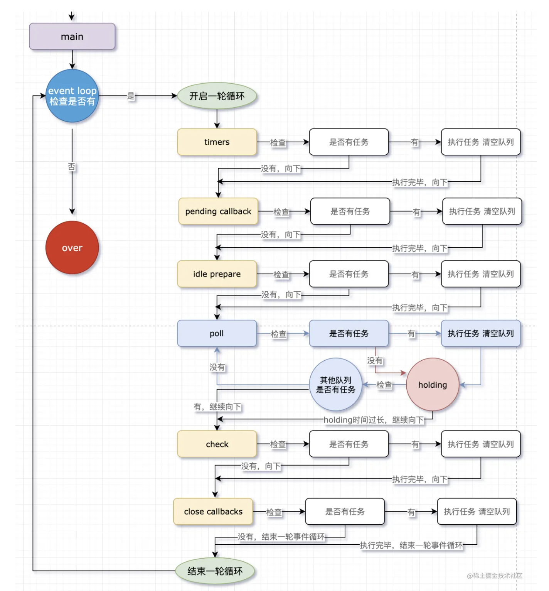

# node

## 1. 介绍一下对nodejs的异步IO原理

四个共同构成Node异步I/O模型的基本要素:

1. `事件循环`
2. ` 观察者` 
3. ` 请求对象` 
4. ` 执行回调`

#### Node事件循环

> https://juejin.cn/post/7010308647792148511
> https://github.com/febobo/web-interview/issues/167

##### 是什么

在`NodeJS`中，事件循环是基于`libuv`实现，`libuv`是一个多平台的专注于异步IO的库

`EventLoop`存在6个阶段，每个阶段都有对应的一个先进先出的回调队列

##### 流程

一次循环要经过六个阶段：

- **timers：计时器**
  - **setTimeout、setInterval等的回调函数存放在里边**
  - 每次到达这个队列，会检查计时器线程内的所有计时器，计时器线程内部多个计时器按照时间顺序排序。

- pending callback：待定队列，执行延迟到下一个循环迭代的 I/O 回调，即上一轮循环中未被执行的一些I/O回调

- idle prepare：仅系统内部使用

- **poll：轮询队列（除timers、check之外的回调存放在这里）**
  - 如果poll中有回调函数需要执行，依次执行回调，直到清空队列。
  - 如果poll已经是空队列了。则会在这里等待，同时轮询检查其他队列是否有任务。
    - 如果其他队列中出现回调，则从poll向下到over，结束该阶段，进入下一阶段。
    - 如果其他队列也都没有回调，则持续在poll队列等待，直到任何一个队列出现回调后再进行工作。

- **check：检查阶段（使用 setImmediate 的回调会直接进入这个队列）**

- close callbacks：一些关闭的回调函数


在`Node`中，同样存在宏任务和微任务，与浏览器中的事件循环相似

微任务对应有：

- process.nextTick
- Promise的then回调

宏任务对应有：

- timer queue：setTimeout、setInterval
- poll queue：IO事件
- check queue：setImmediate
- close queue：close事件


接下来说下微任务**nextTick 与 Promise**：

- 二者都是「微队列」，执行异步微任务。

- 二者不是事件循环的一部分，程序也不会开启额外的线程去处理相关任务。

- 微队列设立的目的就是让一些任务「马上」、「立即」优先执行。

- nextTick与Promise比较，nextTick的级别更高。



#### 每走一个异步宏任务队列就查一遍nextTick和promise？还是每执行完宏任务队列里的一个回调函数就查一遍呢？

#### 如果在poll的holding阶段，插入一个nextTick或者Promise的回调，会立即停止poll队列的holding去执行回调吗？

```js
// 说说下边代码的执行顺序，先打印哪个？
const fs = require('fs')fs.readFile('./poll.js', () => {  
  setTimeout(() => console.log('setTimeout'), 0)  
  setImmediate(() => console.log('setImmediate'))
})
```

上边这种代码逻辑，不管执行多少次，肯定都是先执行setImmediate。

因为fs各个函数的回调是放在poll队列的。当程序holding在poll队列后，出现回调立即执行。

回调内执行setTimeout和setImmediate的函数后，check队列立即增加了回调。

回调执行完毕，轮询检查其他队列有内容，程序结束poll队列的holding向下执行。

check是poll阶段的紧接着的下一个。所以在向下的过程中，先执行check阶段内的回调，也就是先打印setImmediate。

到下一轮循环，到达timers队列，检查setTimeout计时器符合条件，则定时器回调被执行。

#### setImmediate和setTimeout(0)谁更快

- setImmediate的回调是异步的，和setTimeout回调性质一致。
- setImmediate回调在`check`队列，setTimeout回调在`timers`队列
- setImmediate函数调用后，回调函数会立即*push*到check队列，并在下次eventloop时被执行。setTimeout函数调用后，计时器线程增加一个定时器任务，下次eventloop时会在timers阶段里*检查判断*定时器任务是否到达时间，到了则执行回调函数。
- 综上，setImmediate的运算速度比setTimeout(0)的要快，因为setTimeout还需要开计时器线程，并增加计算的开销。


二者的效果差不多。但是执行顺序不定

```js
// 多次反复运行，执行效果如下：两句console.log打印的顺序不定。
setTimeout(() => {  
  console.log('setTimeout');
}, 0);

setImmediate(() => {  
  console.log('setImmediate');
});
```

eventloop判断时，发现timers和check队列有内容，进入异步轮询：

第一种情况：等到了timers里这段时间，可能还没有1ms的时间，定时器任务间隔时间的条件不成立所以timers里还没有回调函数。继续向下到了check队列里，这时候setImmediate的回调函数早已等候多时，直接执行。而再下次eventloop到达timers队列，定时器也早已成熟，才会执行setTimeout的回调任务。于是顺序就是「setImmediate -> setTimeout」。

第二种情况：但也有可能到了timers阶段时，超过了1ms。于是计算定时器条件成立，setTimeout的回调函数被直接执行。eventloop再向下到达check队列执行setImmediate的回调。最终顺序就是「setTimeout -> setImmediate」了。

所以，**只比较这两个函数的情况下，二者的执行顺序最终结果取决于当下计算机的运行环境以及运行速度。**


## 2. 对nodejs的进程维护有了解过么？

## 3. 你们有遇到过nodejs一些内存泄露方面的问题吗？说一下内存泄露

## 4. 说说 Node. js 有哪些全局对象

> https://github.com/febobo/web-interview/issues/154

#### 是什么 

在浏览器 `JavaScript` 中，通常` window` 是全局对象， 而 `Nodejs `中的全局对象是 `global`

#### 有哪些

将全局对象分成两类：

- 真正的全局对象
  - Class:Buffer：可以处理二进制以及非`Unicode`编码的数据
  - process：进程对象，提供有关当前过程的信息和控制
  - console：用来打印`stdout`和`stderr`
  - clearInterval、setInterval：设置定时器与清除定时器
  - clearTimeout、setTimeout：设置延时器与清除延时器
  - global：全局命名空间对象
- 模块级别的全局变量
  - __dirname：获取当前文件所在的路径，不包括后面的文件名
  - __filename：获取当前文件所在的路径和文件名称，包括后面的文件名称
  - exports：`module.exports` 用于指定一个模块所导出的内容，即可以通过 `require()` 访问的内容
  - module：对当前模块的引用，通过`module.exports` 用于指定一个模块所导出的内容，即可以通过 `require()` 访问的内容
  - require：用于引入模块、 `JSON`、或本地文件。 可以从 `node_modules` 引入模块。

## 5. 说说对 Node 中的 process 的理解？有哪些常用方法

#### 是什么

`process` 对象是一个全局变量，提供了有关当前 `Node.js `进程的信息并对其进行控制

当我们启动一个`js`文件，实际就是开启了一个服务进程，每个进程都拥有自己的独立空间地址、数据栈，像另一个进程无法访问当前进程的变量、数据结构，只有数据通信后，进程之间才可以数据共享

由于`JavaScript`是一个单线程语言，所以通过`node xxx`启动一个文件后，只有一条主线程

#### 属性和方法

- process.env：环境变量，例如通过 `process.env.NODE_ENV 获取不同环境项目配置信息
- process.nextTick：定义出一个动作，并且让这个动作在下一个事件轮询的时间点上执行
- process.pid：获取当前进程id
- process.ppid：当前进程对应的父进程
- process.cwd()：获取当前进程工作目录，
- process.platform：获取当前进程运行的操作系统平台
- process.uptime()：当前进程已运行时间，例如：pm2 守护进程的 uptime 值
- 进程事件： process.on(‘uncaughtException’,cb) 捕获异常信息、 process.on(‘exit’,cb）进程推出监听
- 三个标准流： process.stdout 标准输出、 process.stdin 标准输入、 process.stderr 标准错误输出
- process.title 指定进程名称，有的时候需要给进程指定一个名称

## 6. 说说 Node 文件查找的优先级以及 Require 方法的文件查找策略?

`require()` 总是会优先加载核心模块

nodeJS对模块加载做了一定程度的优化，**所有文件**只要被引用过一次，就会被缓存起来。

下一次引用时，会先检查缓存中有没有对应的文件，即优先从缓存中加载文件，使得速度更快。


#### nodeJS中的模块主要分为两大类：

- **核心模块**：nodeJS内置的模块，不需要下载就能模块引入，如http、ftp、path等模块（`require('http')`）
- **文件模块**：npm包与自己写的模块文件都是文件模块
  - 路径形式的模块：（`require('./moduleA.js')`）
  - 自定义模块：自定义模块在nodeJS中不是内置就有的，需要从npm库中下载下来，才能被模块引入（`require('express')`）


#### 在Node中引入模块，大致会经历这么几个过程：

> 核心模块是在nodeJS编译时就被加载进来的，所以核心模块不需要路径分析和文件定位。

- **路径分析**：
  - 路径形式的模块：引入时require方法会把路径转化为**硬盘上的真实路径**，并用这个路径作为索引将编译后的结果进行缓存
  - 自定义模块：具体过程是这样的：`当前目录的node_modules文件夹`-->`递归查找父目录的node_modules`-->`直到根目录下的node_modules` 
- **文件定位**
  - 正常的书写方式：当路径分析成功后，就直接找寻该目录下是否有同名文件，有则命中，无则报错
  - 省略扩展名的声明方式：会在该目录下按照.js、.node、.json的顺序逐一尝试
  - 没有指定最终的文件名，直接写到上一层目录名：
    - 首先会在命中的目录下寻找package.json这个文件，并取出json文件中的main属性的值，作为命中的文件
    - 如果找不到package.json或对应的main属性，则会用index作为文件名，而后依旧按照.js、.node、.json顺序去尝试
- **编译执行**


## 7. 说说对中间件概念的理解，如何封装 node 中间件

#### 是什么

在**NodeJS**中，中间件是从http请求开始到响应结束过程中的处理逻辑，通常需要对请求和响应进行处理。

我们都知道在**http**请求中往往会涉及很多动作, 如下：

- 请求体解析，token校验
- 权限校验
- 参数验证
- 日志记录
- 错误处理

**Node中间件**来简化和封装这些基础逻辑处理细节，希望能够把主要精力集中在业务的开发上，以达到提升开发效率的目的

#### 如何封装

`Koa `的中间件就是函数，可以是` async` 函数，或是普通函数

```js
// async 函数
app.use(async (ctx, next) => {
  const start = Date.now();
  await next();
  const ms = Date.now() - start;
  console.log(`${ctx.method} ${ctx.url} - ${ms}ms`);
});

// 普通函数
app.use((ctx, next) => {
  const start = Date.now();
  return next().then(() => {
    const ms = Date.now() - start;
    console.log(`${ctx.method} ${ctx.url} - ${ms}ms`);
  });
});
```

#### 中间件原理

中间件的执行顺序并不是从头到尾，先从最外面的中间件开始执行，`next()` 后进入下一个中间件，一路执行到最里面的中间件，然后再从最里面的中间件开始往外执行。

`Koa` 中间件采用的是洋葱圈模型，每次执行下一个中间件传入两个参数：

- ctx ：封装了request 和 response 的变量
- next ：进入下一个要执行的中间件的函数

## 8. 说一下nodejs里对Buffer数据类型的认识，对于初始化的Buffer，可以实现增加长度吗？

> https://github.com/febobo/web-interview/issues/164

#### 是什么

JavaScript 语言自身只有字符串数据类型，没有二进制数据类型。

在 Node.js中，定义了一个 Buffer 类，该类用来创建一个专门存放二进制数据的缓存区。

一个 Buffer 类似于一个整数数组，但它对应于 V8 堆内存之外的一块原始内存。Buffer 对象的大小不能调整。

#### 使用方法

`Buffer` 类在全局作用域中，无须`require`导入

创建`Buffer`的方法有很多种，我们讲讲下面的两种常见的形式：

- Buffer.from()：返回初始化的新的 Buffer 实例，创建`buffer`后，能够`toString`的形式进行交互
- Buffer.alloc(size[, fill[, encoding]])：返回一个指定字节的 Buffer 实例，如果没有设置 fill，则默认填满 0


所支持的字符集有如下：

- ascii：仅支持 7 位 ASCII 数据，如果设置去掉高位的话，这种编码是非常快的
- utf8：多字节编码的 Unicode 字符，许多网页和其他文档格式都使用 UTF-8
- utf16le：2 或 4 个字节，小字节序编码的 Unicode 字符，支持代理对（U+10000至 U+10FFFF）
- ucs2，utf16le 的别名
- base64：Base64 编码
- latin：一种把 Buffer 编码成一字节编码的字符串的方式
- binary：latin1 的别名，
- hex：将每个字节编码为两个十六进制字符

#### 应用场景

- I/O操作：通过流的形式，将一个文件的内容读取到另外一个文件
- 加密解密
- zlib.js：`zlib.js` 为 `Node.js` 的核心库之一，其利用了缓冲区（`Buffer`）的功能来操作二进制数据流，提供了压缩或解压功能


## 9. 如何实现文件上传？说说你的思路

> https://github.com/febobo/web-interview/issues/171

关于文件的上传的上传，我们可以分成两步骤：

- 文件的上传
- 文件的解析

#### 文件上传

传统前端文件上传的表单结构如下：

```
<form action="http://localhost:8080/api/upload" method="post" enctype="multipart/form-data">
    <input type="file" name="file" id="file" value="" multiple="multiple" />
    <input type="submit" value="提交"/>
</form>
action` 就是我们的提交到的接口，`enctype="multipart/form-data"` 就是指定上传文件格式，`input` 的 `name` 属性一定要等于`file
```

#### 文件解析

在服务器中，这里采用`koa2`中间件的形式解析上传的文件数据，分别有下面两种形式：

- koa-body
- koa-multer


引入`koa-body`中间件

```
const koaBody = require('koa-body');
app.use(koaBody({
    multipart: true,
    formidable: {
        maxFileSize: 200*1024*1024    // 设置上传文件大小最大限制，默认2M
    }
}));
```

获取上传的文件

```
const file = ctx.request.files.file; // 获取上传文件
```

获取文件数据后，可以通过`fs`模块将文件保存到指定目录

```js
router.post('/uploadfile', async (ctx, next) => {
  // 上传单个文件
  const file = ctx.request.files.file; // 获取上传文件
  // 创建可读流
  const reader = fs.createReadStream(file.path);
  let filePath = path.join(__dirname, 'public/upload/') + `/${file.name}`;
  // 创建可写流
  const upStream = fs.createWriteStream(filePath);
  // 可读流通过管道写入可写流
  reader.pipe(upStream);
  return ctx.body = "上传成功！";
});
```


## 10. Node性能如何进监控以及优化？

> https://github.com/febobo/web-interview/issues/173


## 11. 介绍一下 node 核心模块

nodejs中使用的最多的核心模块主要有以下几个

- fs：提供对文件的读写等操作

- http：提供了搭建本地服务器的API

  ```js
  //1. 引入http模块
  const http = require('http')
  
  //2. 通过http对象，创建服务器
  const app = http.createServer()
  
  //3. 监听服务器的请求，并打印请求的URL地址
  app.on('request',(req,res)=>{
      console.log(req.url)
  })
  
  //4. 指定服务器监听的端口号，以及服务器正常启动之后的回调函数
  app.listen(3000,()=>{
      console.log('Server is runnin on localhost:3000...')
  })
  ```

- path：提供文件路径操作的API

  ```js
  // pathDemo.js
  
  const path = require('path')
  // 获取当前执行文件所在目录的完整的路径名
  var dirname = path.resolve(__dirname)
  // 获取当前执行文件的绝对路径，带有文件名以及文件拓展名
  var filename = path.resolve(__filename)
  // 获取当前执行node命令时候的文件夹目录名
  var curDir = process.cwd()
  ```

- os：操作系统相关信息的API

- url：提供了操作URL信息的API

## 12. 介绍 koa2，原理是什么


1. [多进程部署的Nodejs应用有何优缺点，简述一下进程之间的通信方式。](https://github.com/pwstrick/daily/issues/777)

2. [请分析一下nodejs的setTimeOut为何不准时？](https://github.com/pwstrick/daily/issues/779)

3. [nodejs高并发怎么理解？为什么不适合运算量大的操作？如果我要用实现运算量大的操作有什么方式？](https://github.com/pwstrick/daily/issues/780)

4. [nodejs中的异步回调中的错误是怎么处理的？](https://github.com/pwstrick/daily/issues/783)

5. [nodejs的运行原理，有哪些优缺点？对nodejs怎样的看法？](https://github.com/pwstrick/daily/issues/788)

6. [如何实现断点续传？](https://github.com/pwstrick/daily/issues/789)

7. [EventEmitter是什么？有哪些典型的应用场景？](https://github.com/pwstrick/daily/issues/925)

8. [Stream是什么？有哪些典型应用场景？](https://github.com/pwstrick/daily/issues/926)

9. [在文件系统中，readFile()和createReadStream()有哪些区别？](https://github.com/pwstrick/daily/issues/927)

10. [在文件系统中，stat()和fstat()有哪些区别？](https://github.com/pwstrick/daily/issues/928)

11. [在文件系统中，watch()和watchFile()有哪些区别？](https://github.com/pwstrick/daily/issues/929)

12. [如何解决模块循环引用？](https://github.com/pwstrick/daily/issues/943)

    

- [面试官：说说你对Node.js 的理解？优缺点？应用场景？](https://github.com/febobo/web-interview/issues/153)

- [面试官：说说对 Node 中的 fs模块的理解? 有哪些常用方法](https://github.com/febobo/web-interview/issues/156)

- [面试官：说说对 Node 中的 Stream 的理解？应用场景？](https://github.com/febobo/web-interview/issues/165)

- [面试官：说说Node中的EventEmitter? 如何实现一个EventEmitter?](https://github.com/febobo/web-interview/issues/166)

  

- [面试官：如何实现jwt鉴权机制？说说你的思路](https://github.com/febobo/web-interview/issues/170)

- [面试官：如果让你来设计一个分页功能, 你会怎么设计? 前后端如何交互?](https://github.com/febobo/web-interview/issues/172)

# Node题目汇总

<br/>

### 手动实现一个 Promisify 函数

公司：高德

分类：Node、编程题

[答案&解析](https://github.com/lgwebdream/FE-Interview/issues/306)

<br/>

### Node 的适用场景以及优缺点是什么？

公司：道一云

分类：Node

[答案&解析](https://github.com/lgwebdream/FE-Interview/issues/260)

<br/>

### koa2 和 express 区别

公司：菜鸟网络、海风教育

分类：Node

[答案&解析](https://github.com/lgwebdream/FE-Interview/issues/393)

<br/>

### 上传文件的 Content_Type 什么，node 如何拿到上传的文件内容(不适用第三方插件)？文件内容是一次行传输过去的么

分类：Node

[答案&解析](https://github.com/lgwebdream/FE-Interview/issues/591)

<br/>

### 介绍下 pm2，pm2 依据什么重启服务

公司：阿里

分类：Node

[答案&解析](https://github.com/lgwebdream/FE-Interview/issues/565)

<br/>

### 什么是微服务，微服务跟单体应用的区别是啥，用微服务有啥好处？

分类：Node

[答案&解析](https://github.com/lgwebdream/FE-Interview/issues/564)

<br/>

<br/>

### 有没有写过中间件，介绍下自己写过的中间件

公司：阿里

分类：Node

[答案&解析](https://github.com/lgwebdream/FE-Interview/issues/557)

<br/>

### 有没有涉及到 Cluster，说一下你的理解

公司：阿里

分类：Node

[答案&解析](https://github.com/lgwebdream/FE-Interview/issues/556)

<br/>

### master 挂了的话 pm2 怎么处理

公司：阿里

分类：Node

[答案&解析](https://github.com/lgwebdream/FE-Interview/issues/555)

<br/>

### Node 如何和 MySQL 进行通信

公司：阿里

分类：Node

[答案&解析](https://github.com/lgwebdream/FE-Interview/issues/554)

<br/>

### 服务端渲染 SSR

公司：阿里

分类：Node

[答案&解析](https://github.com/lgwebdream/FE-Interview/issues/552)

<br/>

### koa 中 response.send、response.rounded、response.json 发生了什么事，浏览器为什么能识别到它是一个 json 结构或是 html

公司：滴滴

分类：Node

[答案&解析](https://github.com/lgwebdream/FE-Interview/issues/505)

<br/>

### koa-bodyparser 如何解析 request

公司：滴滴

分类：Node

[答案&解析](https://github.com/lgwebdream/FE-Interview/issues/504)

<br/>

### pm2 怎么做进程管理，进程挂掉怎么处理

公司：挖财

分类：Node

[答案&解析](https://github.com/lgwebdream/FE-Interview/issues/465)

<br/>

### 不用 pm2 怎么做进程管理

公司：挖财

分类：Node

[答案&解析](https://github.com/lgwebdream/FE-Interview/issues/464)

<br/>

### jsonp 方案需要服务端怎么配合

公司：沪江

分类：Node

[答案&解析](https://github.com/lgwebdream/FE-Interview/issues/463)

<br/>

### node 接口转发有无做什么优化？node 起服务如何保证稳定性，平缓降级，重启等

公司：微医

分类：Node

[答案&解析](https://github.com/lgwebdream/FE-Interview/issues/597)

<br/>

### 介绍 node 文件查找优先级

公司：宝宝树

分类：Node

[答案&解析](https://github.com/lgwebdream/FE-Interview/issues/772)

<br/>

### npm2 和 npm3+有什么区别

公司：宝宝树

分类：Node

[答案&解析](https://github.com/lgwebdream/FE-Interview/issues/771)

<br/>

### Node 不支持哪些 ES6 语法

分类：Node

[答案&解析](https://github.com/lgwebdream/FE-Interview/issues/702)

<br/>

### node 如何进行跨域通信

公司：高思教育

分类：Node

[答案&解析](https://github.com/lgwebdream/FE-Interview/issues/828)

<br/>

<br/>

<br/>